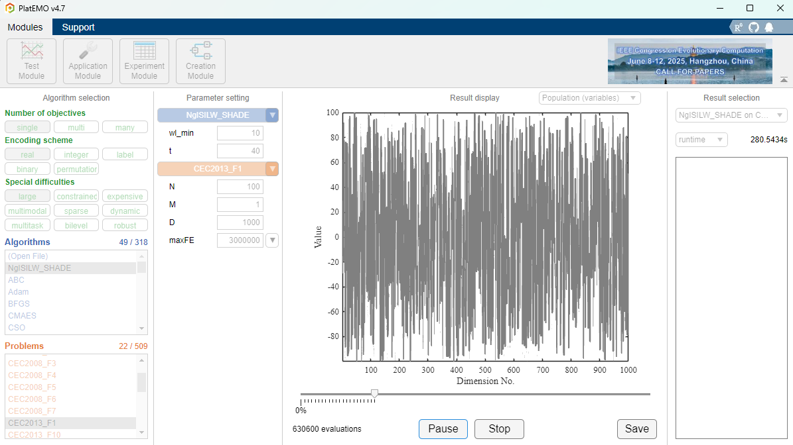

# WindowMethod
Here is the matlab implementation of the "Window method: a plug-in-style large-scale handling technique for evolutionary algorithm" (based on PlatEMO).

Large-scale optimization constitutes a pivotal characteristic of numerous real-world problems, where large-scale evolutionary algorithms emerge as a potent instrument for addressing such intricacies.
However, existing methods are typically tailored to address only a particular class of problems and lack the versatility to be readily adapted to other evolutionary algorithms or generalized across diverse problem domains.
To address the issue above, **this paper proposes the window method, a simple yet effective enhancement that can be seamlessly integrated into low-dimensional evolutionary algorithms to bolster their performance in large-scale optimization.** Specifically, the window method involves grouping a subset of randomly selected dimensions into a window during each iteration, restricting the population's evolution to the dimensions within this window. 
Furthermore, the effectiveness of the window method is analyzed, and the window is improved based on the insights gained, including the isometric segmentation individual-level window length and the neural network-guided window element. Extensive experiments on single-objective, multi-objective, constrained multi-objective, and discrete test problems with large-scale attributes demonstrate that the proposed method significantly mitigates the curse of dimensionality and enhances the performance of EAs in large-scale settings.

# Code Statement
1. Our code is based on PlatEMO.
2. With respect to large-scale single-objective problems, we provide methods for embedding the window method and its improved version into the SHADE algorithm, namely W_SHADE and NgISILW_SHADE.
3. Regarding generalisability, we provide code for the methods OFA, PSO, DE, MVPA combined with NgISILW.
4. For large-scale multi-objective problems, we provide NgISILW_MOEADDE.

# Quick Start
1. Users need to download PlatEMO.
> https://github.com/BIMK/PlatEMO
2. Put the code from this repository in the \PlatEMO\Algorithms folder.
3. Select an algorithm, problem, set run parameters and run.


# Embedding into new algorithms
The proposed window method is very convenient and easy to embed into most evolutionary algorithms and work.
1. First, you need the algorithm being embedded to be able to be executed correctly by PlatEMO.
2. Initialise window method instances during the population initialisation phase.
``` matlab
t=40; wl_min=10;
M=size(Population.objs,2);
if size(Population.cons,2)==1
    if sum(Population.cons)==0
        C=0;
    else
        C=1;
    end
else
    C=size(Population.cons,2);
end
ngisilw=NgISILW(Problem.D,wl_min,Problem.N,Problem.D,M,C,Population,t);
```
3. Limit evolutionary operations to the window after subpopulation generation is complete and before evaluating the subpopulation.
``` matlab
%% operator now dim
offDec_window=Population.decs;
for i =1:Problem.N
    window=ngisilw.windows{i};
    offDec_window(i,window)=OffDec(i,window);
end
Offspring = Problem.Evaluation(offDec_window);

replace             = FitnessSingle(Population) > FitnessSingle(Offspring);
Population(replace) = Offspring(replace);
```
4. Update all individual windows.
``` matlab
ngisilw=ngisilw.next_step(Population,gen);
```
